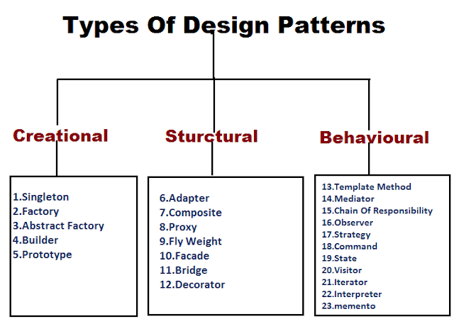

## Importance of Desing Patterns and Their Uses

Jumping into any environment without a map or building a building without a blueprint can be a troublesome experience. In the field of computer science, design patterns can viewed as the blueprint or map for developers and programmers to use. Design patterns are reusable solutions to common recurring problems in the field. There are numerous types of design patterns each used for certain problems. Time is saved, effort is preserved, and structure is provided when implementing these design patterns. Their uses expand towards communication efforts as well. From one developer to another, stating the type of design pattern to be used for a solution instead of explaining the concept of it saves time. There are three types of design patterns, there are creatinal, structural, and behavioural patterns.

## My Experience

When first discovering design patterns, I took it literally. Design patterns I thought were actual web designs for websites developers used but that was not the case. Through class and my research on the topic, I was proven wrong but learned about a valuable tool. One of the design patterns covered in class which I have also seen on numerous websites, was the singleton pattern. Although I have never used this pattern, it is the best one I can explain its use case for. A singleton pattern has to deal with creating a globally accessible instance of a class. A good example to explain this concept is a sports team. Say a tennis team has one head coach, that coach can be seen as a single instance of the class head coach. This class is then accessible to all players. Having multiple head coaches can cause conflicts between the players ruining the efficiency of the entire team. Meaning having multiple instances of a single class can affect the task of managing a database connection.

At the time of writing this essay, I have no experience so far dealing with the singleton pattern. Though moving deeper into the final project there seems to be a similarity between the singleton pattern and our Prisma client. The final project that I am a part of is an AP course manager, displaying information regarding AP classes. This project will enable the school to add, delete, and update AP course information. Whenever we import Prisma, we are using the Prisma Client, leading to Prisma treating the Prisma instance as a singleton. After creating the prisma instance we can export it and use it. We only want one database connection open at a time. Hence it behaves similarly to a singleton pattern.

## My Future Goals with Desing Patterns

I would like to do projects that implement these design patterns. There are numerous patterns and I would like to get practice with the most important ones. I believe having a firm understanding of these patterns will strengthen my career. I wish to have a good understanding of each of the types of patterns before I graduate. There are a total of 23 design patterns all separated into their different categories or types. I strive to have a good understanding or great familiarity with each of them, so that I may have an easier time when running into common recurring problems in the field of computer science.

*AI was not used in creating this essay*
