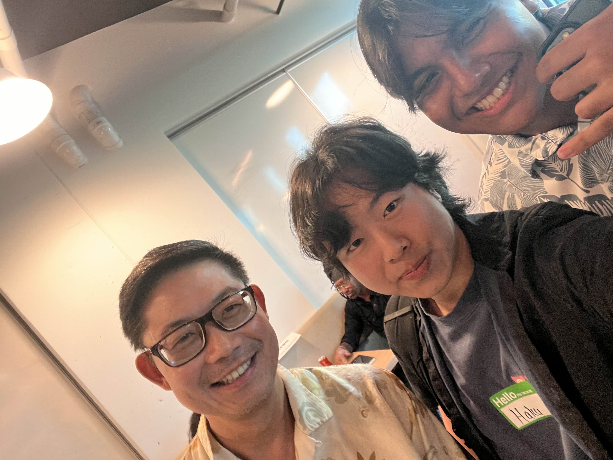

## The Event

The event took place at UH Manoa at Walter Dods. Jr. Rise Center from 4:30 PM to 6:30 PM. The event started with ice breakers where we got to meet fellow UH students who were also present at the event. I learned from one of the students named Ryan, that there is a program called Leap Start that helps students build experience in the Tech, IT, and Cybersecurity fields. As someone who has no experience I highly value this information and am looking forward to applying to this program soon. After the Icebreakers students were encouraged to share their ideas such as start-ups or invite other students to apply to their ongoing projects. One very interesting project idea was a video game language-learning app. I have seen similar apps where user input their tasks completed and they level up in the game to gain rewards. Bringing this aspect to language learning seems very brilliant and will encourage a lot of people to install this app once created. Other language learning platforms such as Duo Lingo give you a streak but it doesn't seem as challenging as a video game. I am excited to see how this project's final look will play out. After all the ideas were given, we went onto the main course of the event, meeting the pros.

## Inspired and Motivated

One of the pros I met was Sutanto Widjaja. He is currently a Senior Vice President at Farther, a company that helps other companies make the right business decisions. Mr. Widjaja shared his experiences in the field and how he has made it to where he is now. He has a BS in Electrical Engineering and Computer Science from UC Berkeley and a Master of Business Administration from Standford University. What's obvious is he took his education very seriously and that is something for me to look at. Ever since I started college I adopted the mentality that, "C's get degrees". Which is not a healthy mindset at all. From what I see if I can make it count at practice I can make it count out on the field. If I can't do simple tasks how will I do complicated ones? It was an eye-opening conversation I and the other students had with Mr. Widjaja. He gave us not only insights into how his industry works but also certain strategies to look into. An example is when he mentioned why should smaller companies try to invest so much into researching and creating language models when bigger companies like Open AI, Google, and more can do all of it. Saving resources and time ensuring that the path ahead of them is carved up. I noticed that if I want to move in a positive direction in my career I have to be on the top of my game and aware of other aspects aside from just programming. 

*AI was not used in creating this essay*
