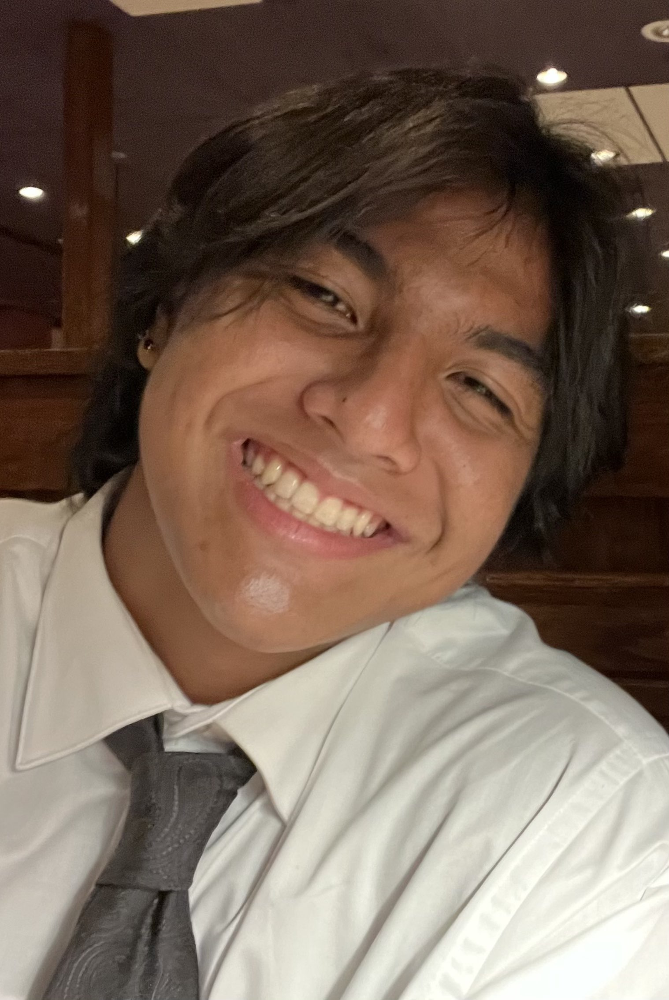

## Why Computer Science?

I am Deavyn Etscheit a student enrolled at the University of Hawaii at Manoa's Computer Science Program. I chose to pursue Computer Science based on the Computer Science courses at took at my high school Mid-Pacific Institute. Another reason I have chosen to pursue this field is due to my belief that it will become a big part shortly. Especially since the release and ongoing development of ChatGPT and other similar ai models heads are starting to turn. I want to be a part of such projects, developing products that can bring huge benefits to many people. I use ChatGPT and Claude to help in my studies and they have deepened my understanding of the basic concepts of Computer Science. In short, I chose Computer Science for its robustness in the tech industry and its exciting ongoing development.

## My Interests in Computer Science

I have taken an interest in Cybersecurity, Web Development, and most recently Machine Learning. In terms of pursuing a specific route for my future endeavors, I am unaware as of this moment. The industry is filled with multiple possible routes and to be honest, is quite hard to make a decision. Of the three interests I have listed, Machine Learning proves to be the most interesting subject. I personally never paid much attention to it till ChatGPT came out. It inspired me to look into the topic as the product was bizarre to me.

A reason why Cybersecurity piqued my interest was due to my own faulty experience getting compromised online. My email account and other accounts over various platforms associated with it were compromised. Luckily I was able to recover all of my accounts and ensure the problem would fail to happen again. I wondered how I ended up getting into a terrible situation and wanted to prevent such an occurrence ever again. My research led me to the importance of Cybersecurity along with other safe practices I should take into consideration. It also made sense to look into this topic as technology is developing better security measures are needed.

Web Development was my first career option. It appeared to be a fun and creative environment. The environment and idea of creating a website where people can interact with it or interact with others appeared to me as a very adventurous and fun position to be in. I visited a lot of websites growing up and always wondered what it took for people to create such an environment. A lot of businesses require a website to reach their selected audiences and Web-development serves as the foundation in enabling such a process. My family runs a business and I would like to be able to provide help to them one day securing their website.

## Skills I Would Like to Develop

Along with my studies at my current institution, I have recently ventured into studying Machine Learning and probability. It is quite difficult, to say the least, but proves to be fun. What I hope to bring from my studies is a better understanding of Machine Learning and learning models along with a better understanding of how probability works in Machine Learning. The concepts are my biggest priority in understanding and later the skills to work on learning models in the future. There is the theory and application of Machine Learning and pursuing the theory aspect of the topic is something I am very much looking forward to.
