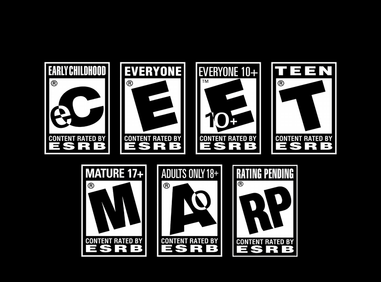

The video targets the ESRB's influence in the modern-day world of video games. Certain aspects make the entirety of the game rating industry lackluster in keeping certain age categories from accessing content they shouldn't be accessing. This video points out the weaknesses in ESRB's efforts and the game companies in preventing mature games from reaching immature audiences. This provides its viewers with information regarding what is the ESRB and how it's just a name these days due to the digitization of modern games.

The ESRB project video was made using the After Effects application. I have been using this software since high school and it comes in convenient when working with video projects. I have also had experiences with other editing software such as Sony Vegas Pro and Apple's Imovie. This allowed me to be a valuable asset in the group as the video editor. One major portion of my role was to ensure that all necessary materials were available to ensure the video would be completed without anything missing. This includes images, audio recordings, and video footage.

This project taught me a lot about keeping the project materials in check. When creating project videos like these it's important to have everything available to prevent myself from jumping all over the place as you can get creative when it comes to working on videos. But at the same time, it's important to stick to the rubric given, which is why having most of the materials if not all of the materials ready to be used. I also learned to take criticism and be patient, it took multiple drafts to conclude that all the group members liked the conclusion. I wanted to get this project over with as finals were coming up but it made sense to take time and ideas from others to ensure the project was really at its best.

You can view the video here at [Deavyn Etscheit ESRB Project Video](https://drive.google.com/file/d/1n_0AfasLm1UJrdbm3h1Q7fpznWz0w-Wg/view?usp=sharing).
